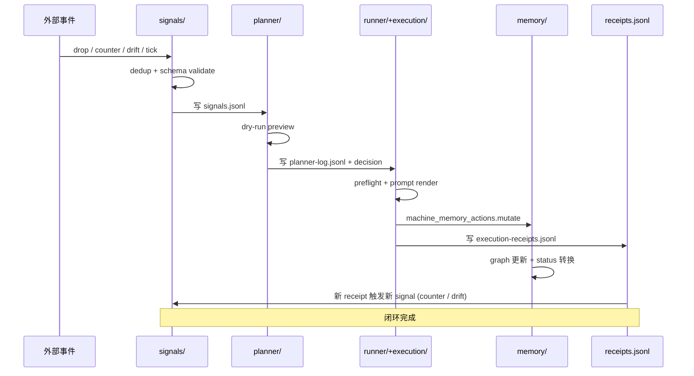

# A — 核心子系统深度剖析

> 只读分析。SoT：`src/aiwiki/{agent_loop,signals,planner,runner,execution,memory}/`、`docs/Furnace Evolution Mechanics.md`。

## 0. 选择子系统的理由

炼丹炉的核心循环模型是 `Signal → Planner → Phase → Feedback → Learning`。本文档解剖循环上 4 个最关键的子系统：

1. **`signals/`**（感知层）— 1427 行
2. **`planner/`**（决策层）— ~580 行
3. **`runner/` + `execution/`**（执行层）— ~14,800 行（占核心 ~60%）
4. **`memory/`**（学习/记忆层）— ~3771 行

外加 1 个编排入口：**`agent_loop.py`**（351 行）。

合计约 20,929 行，占 `src/aiwiki/` 核心 86%。

## 1. `agent_loop.py` — 编排入口（351 行）

### 角色
夜间 agent loop 的总编排器。把 `signals → planner → (preview | apply light lane) → receipt` 串起来。

### 关键事实
- 不拥有任何业务逻辑，只做编排。
- 自动采纳能力（auto-adopt L1 / L2 / L3 / Judgment）默认关闭，必须显式 env flag opt-in：`AIWIKI_NIGHTLY_AUTO_ADOPT_*`。
- 所有自动采纳都强制 receipt 落盘，保证 revert path。
- 只支持 3 个 primitive 的 light lane 自动应用：`compile / lint / nightly`。Heavy lane 永远 preview-only。

### 评估
- **设计正确**：编排和逻辑分离，编排层薄。
- **安全边界清晰**：env flag 显式 opt-in 是工程上的诚实选择，不做隐式自治。
- **没有膨胀风险**：351 行是合理上限。

## 2. `signals/` — 感知层（1427 行）

### 文件结构
| 文件 | LoC | 角色 |
|---|---|---|
| `adapters.py` | 518 | 各类输入源（drop event / counter-evidence / drift / nightly tick）→ SignalSeed |
| `collector.py` | 342 | 去重 + trace 链路 + 写入 `.aiwiki/state/signals.jsonl` |
| `schema.py` | 544 | Signal schema 定义（kind / source / payload / trace_id / dedupe_key） |

### 核心数据流
```
external event (drop/drift/counter/tick)
   → adapters.SignalSeed
   → collector.collect_signals (dedup by hash)
   → signals.jsonl (append-only)
   → planner consumes
```

### 评估
- **职责单一**：感知→标准化→去重→落盘。
- **append-only + dedupe_key** 是合理设计：保证幂等 + 可回溯。
- **1427 行偏大**：但 schema.py 544 行包含大量 TypedDict 和 validator，是规模合理代价。
- **`adapters.py` 518 行可能含未实际启用的源**：如果某些 adapter 没有真实 receipt 数据，是 D 文档应该补充扫描的死代码候选。

## 3. `planner/` — 决策层（~580 行，最薄）

### 文件结构
| 文件 | LoC | 角色 |
|---|---|---|
| `dry_run.py` | (未单独读取) | preview_alchemy_lane / preview_distill / preview_judge / preview_propose / preview_review |
| `log_writer.py` | (未单独读取) | 写 `planner-log.jsonl` |
| `rollback.py` | 165 | preview_planner_log_rollback |
| `schema.py` | 195 | Planner decision schema |

### 公开 API（来自 `planner/__init__.py`）
```python
preview_alchemy_lane         # heavy 链路 dry-run
preview_distill_primitive    # 提案凝结金丹
preview_judge_primitive      # 提案产出 judgment
preview_propose_primitive    # 提案 L3 prompt/policy 修改
preview_review_primitive     # 提案 review 动作
preview_planner_log_rollback # 回滚 preview
write_planner_log            # 落盘 decision
```

### 评估
- **planner 极薄**（~580 行）符合"observe-only + execute-mode partial"的诚实定位。
- **没有 ML 模型 / 复杂启发式**：当前 planner 主要是规则 dispatch + dry-run preview。
- **关键不变量**：planner **只写 log + 出 preview，不直接 mutate runtime state**。Mutation 全部下放到 runner/execution，确保 receipt gate 不被绕过。
- **未来扩张风险**：如果有人想往 planner 里加"自动决策模型"，必须先证明 receipt-backed compounding sample 存在（即 AOS-004 翻 pass），否则就是盲目扩权。这正是 Slimdown Plan 冻结的内容。

## 4. `runner/` + `execution/` — 执行层（~14,800 行，最大）

### `runner/` 文件结构（~7137 行）
| 文件 | LoC | 角色 |
|---|---|---|
| `alchemy.py` | **2589** | 重炼丹主链路（heavy lane）|
| `workflows.py` | **2347** | 命令级编排（compile / nightly / ask / review / distill）|
| `prompts.py` | 1145 | Prompt 渲染与拼装 |
| `auto_adopt.py` | 883 | L1/L2/L3/Judgment 自动采纳（receipt-gated）|
| `receipts.py` | 307 | Receipt 写入与校验 |
| `commands.py` | 256 | CLI command 函数体 |
| `automation.py` | 190 | 高级 automation hook |
| `preflight.py` | 129 | 执行前置校验 |
| `clients.py` | 128 | LLM client 抽象包装 |
| `background.py` | 96 | 后台 job 提交 |
| `interfaces.py` | 12 | SupportsComplete 等 protocol |

### `execution/` 文件结构（~7693 行）
| 文件 | LoC | 角色 |
|---|---|---|
| `alchemy.py` | **1624** | 轻炼丹链路（light lane）|
| `machine_memory_actions.py` | **1303** | machine memory graph 的 mutation 入口 |
| `l3_proposals.py` | **1059** | L3 prompt/policy 提案生成 |
| `protocol_learnings.py` | 965 | L2 协议学习 |
| `ask.py` | 819 | 问答执行 |
| `concept_rewrite.py` | 548 | 概念重写（L0-L1）|
| `archive.py` | 460 | 归档与 aging |
| `lifecycle.py` | 423 | 资产生命周期 |
| `audit_preview.py` | 359 | 审计预览 |
| `machine_memory_batch.py` | 362 | 批处理 |
| `review.py` | 202 | Review 动作 |
| 其他 | ~600 | run_notes / runtime_surfaces / audit_reconciliation / candidates |

### 关键观察

#### 4.1 `runner/alchemy.py` (2589 行) vs `execution/alchemy.py` (1624 行) — 两份 alchemy
- `runner/alchemy.py` — heavy lane（事件驱动深链路）
- `execution/alchemy.py` — light lane（定时驱动窄链路）

**评估**：分层正确——heavy/light 调度模型对应 OS 的 batch vs interactive queue。但 4213 行（合计）的 alchemy 逻辑是炼丹炉最复杂的部分，也是任何 refactor 的雷区。

#### 4.2 `auto_adopt.py` (883 行) — receipt-gated 自治核心
- 包含 L1/L2/L3/Judgment 四种自动采纳的判定逻辑
- 每一次自动采纳必须：(a) 生成 receipt，(b) 可 revert，(c) 通过 hash gate
- **这是炼丹炉作为 Agent OS 的核心创新**——其他 RAG/agent 项目几乎没有这一层。

#### 4.3 `machine_memory_actions.py` (1303 行) — 状态图 mutation 入口
- 所有对 machine memory graph 的写动作都走这里
- 配合 `memory/graph.py`（1609 行）形成读写分离

#### 4.4 `l3_proposals.py` (1059 行) — 系统自修改提案
- 生成"修改自己 prompt/policy"的提案
- 只产 proposal，不自动 apply（需要 auto_adopt_l3 env flag）
- 这是 Agent OS 中"meta-cognition"层，但严格 receipt-gated。

### 评估
- **执行层占核心 60% 是合理的**：runtime 本身就是执行密集型。
- **alchemy 两份是设计选择**：heavy/light 调度模型有效分离了响应延迟需求。
- **`auto_adopt.py` 883 行 + receipt 全闭环**：这是 Agent OS 而不是普通脚本的根本证据。
- **风险点**：`runner/alchemy.py` 2589 行 + `execution/alchemy.py` 1624 行如果继续增长，会成为下一个削薄候选；但当前 AOS-001 已经冻结其扩张。

## 5. `memory/` — 学习/记忆层（~3771 行）

### 文件结构
| 文件 | LoC | 角色 |
|---|---|---|
| `graph.py` | **1609** | machine memory 图结构 + 查询 |
| `execution_surfaces.py` | **1326** | 渲染面（query result → markdown/HTML/JSON）|
| `status.py` | 617 | 节点状态机 |
| `topology.py` | 211 | 拓扑分析（adjacency / anchor / pagerank-like）|

### 评估
- **`graph.py` (1609 行) 是核心**：machine memory 不是 vector store，而是显式的 typed graph（concept / source / decision / judgment / elixir）。这是炼丹炉"事实可追溯"承诺的实现。
- **`execution_surfaces.py` (1326 行) 偏大**：渲染面 1326 行 vs 查询/图 1609 行，比例失调。可能是 render 巨函数堆积，是 D 文档应该追加扫描的候选。
- **`status.py` 617 行的状态机**：节点状态管理（pending / active / archived / superseded / etc）独立成文件是好设计。

## 6. 子系统级 ROI 重排

把 D 文档的 ROI 视角应用到子系统层：

| 子系统 | LoC | 健康度 | 削薄空间 |
|---|---|---|---|
| `agent_loop.py` | 351 | ✅ 优秀 | 无 |
| `planner/` | ~580 | ✅ 优秀 | 无（薄是设计选择）|
| `signals/` | 1427 | ✅ 良好 | 仅扫死代码 adapter |
| `memory/graph.py` | 1609 | ✅ 良好 | 无 |
| `memory/execution_surfaces.py` | 1326 | ⚠️ 嫌疑 | 检查是否有 render 巨函数 |
| `runner/alchemy.py` | 2589 | ⚠️ 大但必要 | 冻结期不动 |
| `runner/workflows.py` | 2347 | ⚠️ 大但必要 | 冻结期不动 |
| `runner/prompts.py` | 1145 | ✅ 良好 | 无 |
| `runner/auto_adopt.py` | 883 | ✅ 良好 | 无（核心 IP）|
| `execution/alchemy.py` | 1624 | ✅ 良好 | 无 |
| `execution/machine_memory_actions.py` | 1303 | ✅ 良好 | 无 |
| `execution/l3_proposals.py` | 1059 | ✅ 良好 | 无 |

### 结论
**子系统层几乎没有可削之处。** 6.5 万行的真正"肥"集中在顶层 `app_*.py` facade/hub（D 文档已识别），子系统包内部结构健康。

这反过来证明：**项目在子包重构（EP-017A/B/C 等历史 milestone）上是成功的**。顶层 `app_*.py` 的存在是为了向后兼容，是欠债，而不是设计缺陷。

## 7. 五大子系统的数据流闭环



## 8. 单句结论

> **炼丹炉的子包内部结构健康，6.5 万行核心代码中真正的"肥肉"集中在顶层 `app_*.py` facade/hub 层；子系统层（`signals / planner / runner / execution / memory`）总计约 2 万行已经是合理实现，进一步削薄会破坏 Agent OS 的核心不变量（receipt-gated mutation + audit-first state）。**

## 9. 给后续 milestone 的提示

- **不要动 `auto_adopt.py`**：883 行是核心 IP。
- **不要拆 `alchemy.py`（heavy/light 两份）**：heavy/light 分层是设计选择。
- **可以检查 `memory/execution_surfaces.py` (1326 行)**：是否存在 render 巨函数，类似 `app_surfaces.py` 模式。
- **可以扫 `signals/adapters.py` (518 行)**：识别未启用的死 adapter。
- **planner 极薄是优点，不是问题**：未来不要给 planner 加智能模型，除非 AOS-004 翻 pass。
